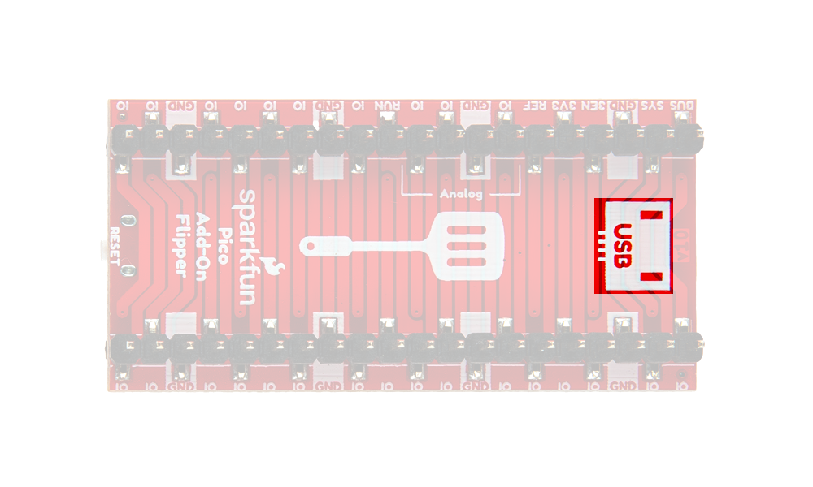
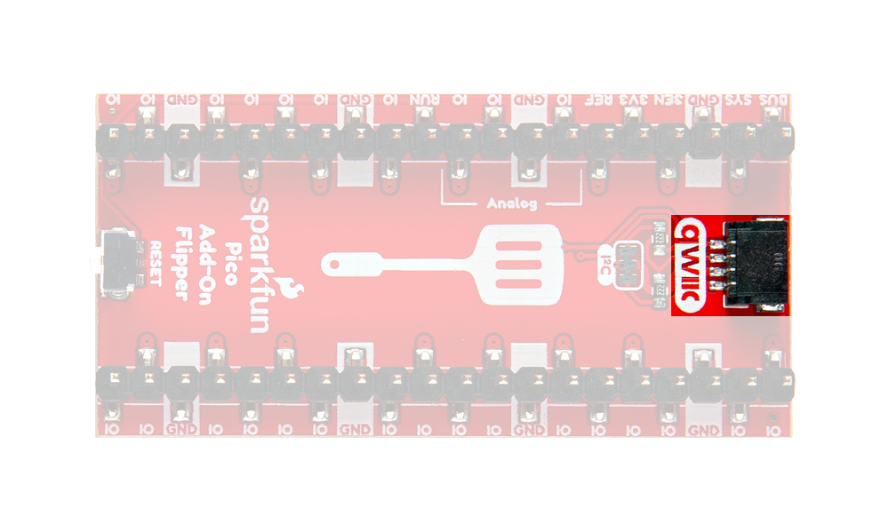

## Board Orientation
The Pico Add-On Flipper can be connected above any of the Raspberry Pi Pico boards, as long as the USB silkscreen or Qwiic connector aligned with the USB connector of the Raspberry Pi Pico. This specific orientation must be utilized because of the pull-up resistors on the I^2^C pin and the `RESET` button connection to the `RUN` pin.

<figure markdown>
[{ width="500" }](./assets/img/hookup_guide/orientation.png "Click to enlarge")
</figure>

<figure markdown>
[{ width="500" }](./assets/img/hookup_guide/qwiic.png "Click to enlarge")
</figure>

Orientation of the Pico Add-On Flipper on top of a Raspberry Pi Pico.

<figure markdown>
[{ width="750" }](./assets/img/hookup_guide/Pico-Add-On-Flipper-Arrows-GIF.gif "Click to enlarge")
<figcaption markdown>Pin connections between the top and bottom of the Pico Add-On Flipper.</figcaption>
</figure>

## XRP Controller Board
Below, is a demonstration of the Pico Add-On Flipper being utilized with the [Experiential Robotics Platform (XRP) kit](https://www.sparkfun.com/experiential-robotics-platform-xrp-kit.html).

<figure markdown>
[{ width="750" }](./assets/img/hookup_guide/Flipper-on-XRP.gif "Click to enlarge")
<figcaption markdown>A demo of the Pico Add-On Flipper being utilized with the XRP kit.</figcaption>
</figure>

## Pico HAT
Pico Add-On Flipper can be utilized to connect multiple Pico HATs to any of the Raspberry Pi Pico boards.

<figure markdown>
[{ width="750" }](./assets/img/hookup_guide/Pico-Add-On-Flipper-Pico-Stack-Fix.gif "Click to enlarge")
<figcaption markdown>A demo of the Pico Add-On Flipper being utilized with two Pico HATs.</figcaption>
</figure>
