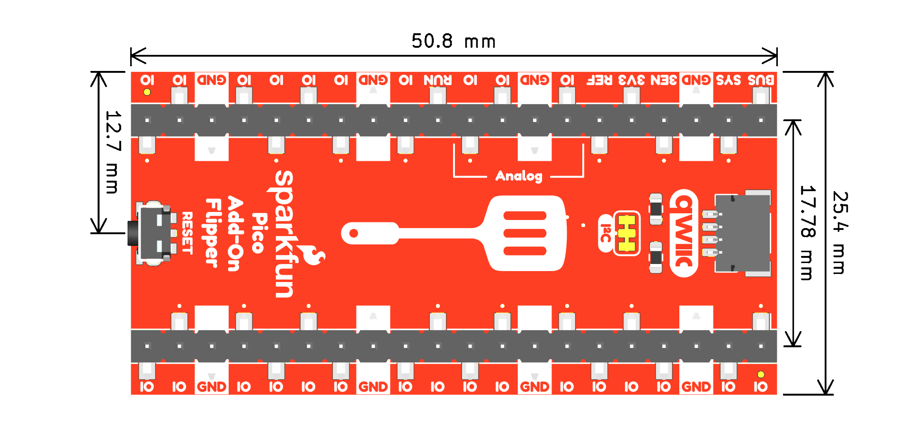
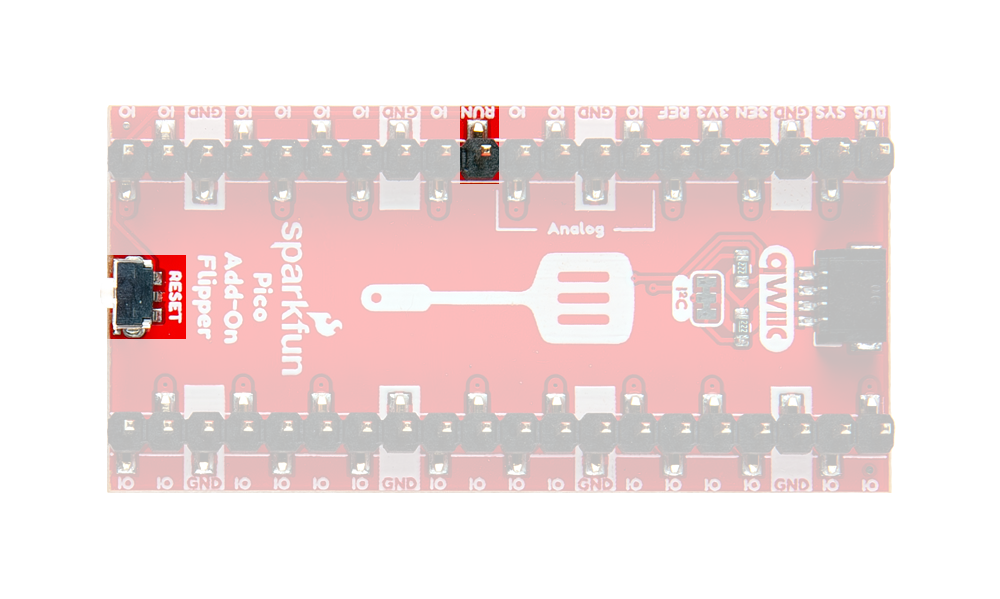
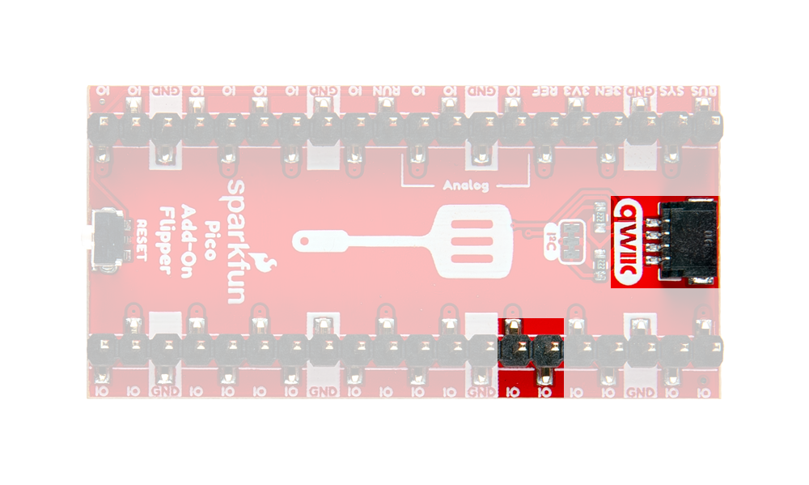
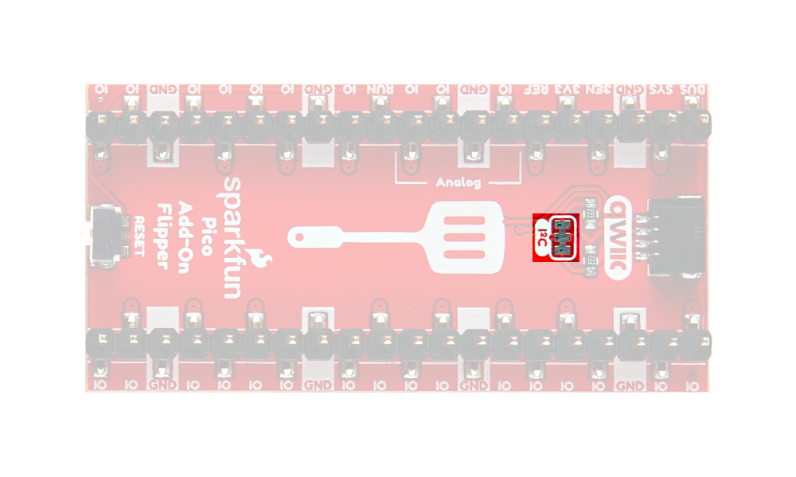

## :material-folder-cog: Design Files

<!-- Import the component -->

-   :kicad-primary:{ .enlarge-logo } Design Files

	---

	- :fontawesome-solid-file-pdf: [Schematic](./assets/board_files/schematic.pdf)
	- :material-folder-zip: [KiCad Files](./assets/board_files/kicad_files.zip)
	- :material-rotate-3d: [STEP File](./assets/3d_model/cad_model.step)
	- :fontawesome-solid-file-pdf: [Board Dimensions](./assets/board_files/dimensions.pdf):
		- 1.0" x 2.0" (25.4mm x 50.8mm)

-   <!-- Boxes in tabs -->

	=== "3D Model"
		

		<model-viewer src="../assets/3d_model/web_model.glb" camera-controls poster="../assets/3d_model/poster.png" tone-mapping="neutral" shadow-intensity="1.3" exposure="0.8" shadow-softness="0.4" camera-target="0m -4m 0m" camera-orbit="-40deg 72deg 89.58m" field-of-view="25.11deg" style="width: 100%; height: 450px;">
		</model-viewer>

		[Download the `*.step` File](./assets/3d_model/cad_model.step "Click download"){ .md-button .md-button--primary width="250px" }

		

		???+ tip "Manipulate 3D Model"
			

			| Controls       | Mouse                    | Touchscreen    |
			| :------------- | :----------------------: | :------------: |
			| Zoom           | Scroll Wheel             | 2-Finger Pinch |
			| Rotate         | ++"Left-Click"++ & Drag  | 1-Finger Drag  |
			| Move/Translate | ++"Right-Click"++ & Drag | 2-Finger Drag  |

			

	=== "Dimensions"
		

		[{ width="450" }](./assets/board_files/dimensions.pdf "Click to enlarge")
		<figcaption markdown>
		Dimensions of the Pico Add-On Flipper.
		</figcaption>
		

		???+ tip "Need more measurements?"
			For more information about the board's dimensions, users can download the [KiCad files](./assets/board_files/kicad_files.zip) for this board. These files can be opened in KiCad and additional measurements can be made with the measuring tool.

			!!! info ":octicons-download-16:{ .heart } KiCad - Free Download!"
				KiCad is free, open-source [CAD]("computer-aided design") program for electronics. Click on the button below to download their software. *(\*Users can find out more information about KiCad from their [website](https://www.kicad.org/).)*

				

				[Download :kicad-primary:{ .enlarge-logo }](https://www.kicad.org/download/ "Go to downloads page"){ .md-button .md-button--primary width="250px" }
				

	
			???+ info ":straight_ruler: Measuring Tool"
				This video demonstrates how to utilize the dimensions tool in KiCad, to include additional measurements:

				

				<article class="video-500px">
				<iframe src="https://www.youtube.com/embed/-eXuD8pkCYw" title="KiCad Dimension Tool" frameborder="0" allow="accelerometer; autoplay; clipboard-write; encrypted-media; gyroscope; picture-in-picture" allowfullscreen></iframe>
				</article>
				{ .qr }
				

## Header Pins
The primary function of the Pico Add-On Flipper is to flip the pin connections between its headers, on the top and bottom of the board.

<figure markdown>
[{ width="750" }](./assets/img/hookup_guide/io-flip.gif "Click to enlarge")
<figcaption markdown>Pin connections between the top and bottom headers of the Pico Add-On Flipper.</figcaption>
</figure>

## Reset Button
The `RESET` button, connected to the `RUN` pin, allows users to reset the program running on the Raspberry Pi Pico board without interrupting power to the board.

<figure markdown>
[{ width="750" }](./assets/img/hookup_guide/io-reset.png "Click to enlarge")
<figcaption markdown>`RESET` button and `RUN` pin on the Pico Add-On Flipper.</figcaption>
</figure>

## Qwiic Connector
The Pico Add-On Flipper features a Qwiic connector to seamlessly integrate with [SparkFun's Qwiic Ecosystem](https://www.sparkfun.com/qwiic). Otherwise, users can also access the I^2^C bus through the header pins on the board.

<figure markdown>
[{ width="750" }](./assets/img/hookup_guide/io-i2c.png "Click to enlarge")
<figcaption markdown>Qwiic connector and I^2^C pins on the Pico Add-On Flipper.</figcaption>
</figure>

???+ tip "What is Qwiic?"

	

	

	<!-- Qwiic Banner -->
	

	[{ width=400 }](https://www.sparkfun.com/qwiic)
	[{ width=400 }](https://www.sparkfun.com/qwiic)
	

	---

	The [Qwiic connect system](https://www.sparkfun.com/qwiic) is a solderless, polarized connection system that allows users to seamlessly daisy chain I^2^C boards together. Play the video, to learn more about the Qwiic connect system or click on the banner above to learn more about [Qwiic products](https://www.sparkfun.com/qwiic).

	

	

	

	

	<iframe src="https://www.youtube.com/embed/x0RDEHqFIF8" title="SparkFun's Qwiic Connect System" frameborder="0" allow="accelerometer; encrypted-media; gyroscope; picture-in-picture" allowfullscreen></iframe>

	{ .qr width=100 }
	

	

	

	

	!!! info "Features of the Qwiic System"

		=== "No Soldering"

			{ align="left" width="90" }
			{ align="left" width="90" }

			Qwiic cables (4-pin JST) plug easily from development boards to sensors, shields, accessory boards and more, making easy work of setting up a new prototype.

		=== "Polarized Connector"

			{ align="left" width="90" }
			{ align="left" width="90" }

			There's no need to worry about accidentally swapping the `SDA` and `SCL` wires on your breadboard. The Qwiic connector is polarized so you know you’ll have it wired correctly every time.

			The part numbers for the PCB connector is `SM04B-SRSS` ([Datasheet](https://cdn.sparkfun.com/assets/parts/1/2/2/8/9/Qwiic_Connector_Datasheet.pdf)) and the mating connector on the cables is `SHR04V-S-B`; or an equivalent *1mm pitch, 4-pin JST connection*.

		=== "Daisy Chain-able"

			{ align="left" width="90" }
			{ align="left" width="90" }

			It’s time to leverage the power of the I^2^C bus! Most Qwiic boards will have two or more connectors on them, allowing multiple devices to be connected.

## Jumper
There is an `I2C` jumper on the top of the board that can be cut to disconnect the pull-up resistors on the `SCL` and `SDA` connections of the Qwiic connector.

<figure markdown>
[{ width="750" }](./assets/img/hookup_guide/jumpers.png "Click to enlarge")
<figcaption markdown>The jumpers on the top of the Pico Add-On Flipper.</figcaption>
</figure>

???+ note "Never modified a jumper before?"
	Check out our <a href="https://learn.sparkfun.com/tutorials/664">Jumper Pads and PCB Traces tutorial</a> for a quick introduction!

	

	-   <a href="https://learn.sparkfun.com/tutorials/664">
		<figure markdown>
		
		</figure>

		---

		**How to Work with Jumper Pads and PCB Traces**</a>

	

